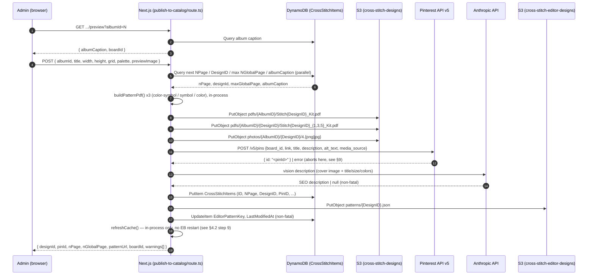

# Publish to Catalog (web) — design publish pipeline, web-admin path (F1b)

> Contract type: workflow / multi-system orchestration
> Status: code-observed; author-verified (built and documented in the same
> session, 2026-08-04/05), not run through the independent-agent audit
> process that produced the other contracts in this folder — see
> [README.md](./README.md) Provenance section.
> Source of truth: `web/src/app/api/admin/publish-to-catalog/route.ts`

---

## 1. Contract Name

**Publish to Catalog — web admin path (F1b)**

A second, independent implementation of the same design-publish contract
documented in [upload-flow.md](./upload-flow.md) (F1). Triggered by an
admin-only button inside the live pattern editor (`/photo-to-cross-stitch`)
instead of the desktop Uploader app. Publishes one new cross-stitch design
across the same three external systems (S3, Pinterest, DynamoDB) that F1
touches, minus Elastic Beanstalk (see §4.2 step 9).

Implemented by `POST /api/admin/publish-to-catalog`
(`web/src/app/api/admin/publish-to-catalog/route.ts:63`), triggered by the
"⬆ Publish to Catalog" button in
`web/src/app/photo-to-cross-stitch/ConvertClient.tsx` (admin-gated via
`isAdmin`, only enabled when `hasDesign`).

---

## 2. Purpose

Until 2026-08-04, publishing a new design required the desktop Uploader
app and a local folder containing a source PDF + `.scc` chart + AlbumID
marker file (F1). This meant every new design had to originate outside the
web app and be walked through a separate GUI tool.

This contract exists so an admin can build (or import-and-refine) a design
directly in the live web editor — which already holds the full
grid/palette/width/height/color-count in memory — and publish it to the
live catalog **without ever leaving the browser or producing a `.scc`
file**. The editor's own pattern data becomes the chart; no external chart
format is written for this path.

1. Admin builds/finishes a pattern in `/photo-to-cross-stitch` (admin-only,
   `isAdmin` fetched from `/api/admin/me`).
2. Clicks **⬆ Publish to Catalog**, which opens `PublishToCatalogDialog.tsx`
   and captures a canvas preview via `capturePreview()`.
3. Admin types an Album ID; the dialog calls
   `GET /api/admin/publish-to-catalog/preview?albumId=N` to show the
   resolved album caption and Pinterest board before committing.
4. Admin clicks **Publish** → `POST /api/admin/publish-to-catalog` runs the
   full pipeline server-side in one request (no confirmation checkpoint
   mid-flow, unlike F1's CLI variant — the dialog's own Publish click is
   the single confirmation point, see §9).

There is deliberately **no test/dry-run mode** — every publish through
this path is real and public (explicit product decision from Olga during
this session; F1's CLI variant has a `test` parameter that redirects only
the Pinterest board, this one has nothing equivalent).

---

## 3. Scope

### In scope

- The body of `POST /api/admin/publish-to-catalog`
  (`web/src/app/api/admin/publish-to-catalog/route.ts:63-232`) and its
  direct sub-calls.
- The new library modules that exist only for this path:
  `design-sequencing.ts`, `pinterest-boards.ts`, `pinterest-theme.ts`,
  `pinterest-token.ts`, `pinterest-pin.ts`, `design-seo-description.ts`,
  `pattern-pdf.ts` (factored out of `/api/convert/pdf` for reuse).
- The `GET /api/admin/publish-to-catalog/preview` lookup endpoint.
- Where this path's behavior **differs** from F1's — see §4 and §9.
- The 2026-08-05 IAM change that made this path work (§8).

### Out of scope (unchanged from F1 — see sibling contracts)

- S3 key naming conventions → `s3-paths.md` (this path reuses the exact
  same key templates for PDFs/photos, see §4.4).
- DynamoDB attribute schema → `dynamodb-schema.md` (this path writes the
  same `DESIGN` item shape, with two attributes it never sets: see §4.5).
- DesignID/NPage/NGlobalPage allocation semantics → `design-id.md` (same
  algorithm, ported to TypeScript — see §4.3).
- AlbumID format → `album-id.md` (unchanged, `ALB#{AlbumID:D4}`).
- Pinterest pin payload shape → `pinterest-metadata.md` (theme detection,
  title/description/alt-text rules ported verbatim from
  `PinterestHelper.cs`/`PinterestUploader.cs` into `pinterest-theme.ts`).

---

## 4. Data Formats

### 4.1 Sequence diagram



### 4.2 Numbered steps with code references

| # | Step | Code | Writes | Failure mode |
|---|------|------|--------|--------------|
| 0 | Admin auth | `requireAdmin(request)` (`web/src/lib/admin-auth.ts:4`) | none | 401/403, aborts before any side effect |
| 1 | Input validation (albumId, title, grid/palette non-empty) | `route.ts:70-85` | none | 400, aborts |
| 2 | Sequencing — `getNextNPage`, `getNextDesignId`, `getMaxGlobalPage`, `getAlbumCaption` run in parallel via `Promise.all` | `design-sequencing.ts:27,44,60,76`; called at `route.ts:91-97` | none — DDB reads only | Throws if DDB unreachable; nothing written yet. **No re-query immediately before the S3 writes** (unlike F1, which re-queries at step 1 right before upload) — this path queries once, up front |
| 3 | Resolve cover/pin image: decode client-captured `previewImage` data URL, or call `renderCoverThumbnailPng()` if none was sent | `route.ts:104-118` | none yet | Throws on unrecognized data URL format (`decodeDataUrlImage`, `route.ts:52-60`) |
| 4 | Build 3 kit PDFs in-process (`color-symbol`/`symbol`/`color`) | `buildPatternPdf()` (`web/src/lib/pattern-pdf.ts`), called 3x at `route.ts:121-125` | none yet (in memory) | Throws on invalid grid/palette (already validated at step 1, so effectively unreachable) |
| 5 | Upload PDFs + image to S3 (5 objects, `Promise.all`) | `route.ts:129-136` | 5 S3 objects, bucket `cross-stitch-designs` | Throws on any S3 error; **no rollback** — same non-transactional philosophy as F1 |
| 6 | Create Pinterest pin | `createPinterestPin()` (`web/src/lib/pinterest-pin.ts:48`), called at `route.ts:141-145` | 1 Pinterest pin | Throws on board-lookup miss, token failure, or non-2xx/missing-id response; **caught explicitly and returns HTTP 502 before the DDB insert** (`route.ts:146-153`) — same hard stop as F1 step 3/4, but here it's an explicit early return with a clear error message rather than an uncaught exception. **All 5 S3 objects orphaned; sequence numbers burned** (no re-query — see step 2 note) |
| 7 | AI SEO description (vision) | `generateSeoDescription()` (`web/src/lib/design-seo-description.ts:60`), called at `route.ts:157-165` | none — API call only | **Non-fatal**: any failure is caught, pushed to `warnings[]`, and the pipeline continues without `SeoDescription` |
| 8 | DynamoDB `PutItem` into `CrossStitchItems` | `route.ts:171-190` | 1 DDB row | No `ConditionExpression` (same as F1); would silently overwrite an existing row at the same `(ID, NPage)` |
| 9 | Editor-pattern stamp: `PutObject` to `cross-stitch-editor-designs` + `UpdateItem` on the DDB row | `route.ts:194-210`, inlined equivalent of `web/scripts/stamp-editor-pattern.ts` | 1 S3 object, 1 DDB update | **Non-fatal**: caught, pushed to `warnings[]`. Effect: "Open in editor" doesn't work yet for this design until retried |
| 10 | Cache refresh — **no Elastic Beanstalk restart** | `refreshCache()` (`web/src/lib/data-access.ts:905`), called at `route.ts:214-218` | clears 4 in-process Maps on the handling instance | **Non-fatal**: caught, pushed to `warnings[]`, suggests retrying via the "Refresh design cache" admin button. **Deliberately different from F1's step 5** — `cross-stitch-com-env-clone` runs exactly one EC2 instance (confirmed via `eb health` on 2026-08-04), so an in-process cache clear is equivalent to F1's EB restart for this environment, without the restart's availability blip. **This assumption breaks if the environment is ever scaled to multiple instances** — a request handled by a different instance than the one that ran the publish would still see stale cache. F1's EB restart has no such blind spot |

### 4.3 Data carried through the flow

Unlike F1's mutable `PatternInfo` instance, this path passes plain values
through a single request scope — no cross-step class, no PDF text-parsing
step (title/width/height/nColors all come directly from the editor's
in-memory state, sent in the request body):

| Field | Set by | Read by |
|-------|--------|---------|
| `title`, `width`, `height` | Request body, straight from `ConvertClient.tsx`'s editor state | Steps 4, 6, 7, 8 |
| `nColors` | Computed from actual grid usage (`route.ts:87-89`), not raw `palette.length` — a hidden/unused palette entry doesn't count | Steps 6, 7, 8 |
| `nPage` | `getNextNPage(albumId)` (`design-sequencing.ts:27`) — `(max existing NPage under ALB#{AlbumID:D4}) + 1`, zero-padded to 5 digits at `route.ts:98` | Steps 6, 8, 9 |
| `designId` | `getNextDesignId()` (`design-sequencing.ts:44`) — `(global max DesignID via DesignsByID-index) + 1` | Steps 4, 5, 6, 8, 9 |
| `nGlobalPage` | `getMaxGlobalPage() + 1` (`route.ts:97`) | Step 8 |
| `pinResult.pinId` | Step 6 return value | Step 8 (`PinID` attribute) |

### 4.4 Concrete S3 keys (identical templates to F1 — see `s3-paths.md`)

```
pdfs/{AlbumID}/Stitch{DesignID}_Kit.pdf                  (route.ts:130)
pdfs/{AlbumID}/{DesignID}/Stitch{DesignID}_1_Kit.pdf     (route.ts:131)
pdfs/{AlbumID}/{DesignID}/Stitch{DesignID}_3_Kit.pdf     (route.ts:132)
pdfs/{AlbumID}/{DesignID}/Stitch{DesignID}_5_Kit.pdf     (route.ts:133)
photos/{AlbumID}/{DesignID}/4.png  or  4.jpg             (route.ts:134; extension follows the actual captured/rendered format — see §9.4)
```

**No `charts/{DesignID:D5}_*.scc` object is ever written by this path** —
there is no `.scc` chart; the editor's grid/palette is the chart, and its
JSON equivalent is stamped straight to `cross-stitch-editor-designs`
instead (see step 9). This is a deliberate scope simplification.

Bucket names: `cross-stitch-designs` (hardcoded `DESIGNS_BUCKET` constant,
`route.ts:29` — **not** read from `S3_BUCKET_NAME`, which is a different
bucket in this app, see §8) and `cross-stitch-editor-designs` (hardcoded
`EDITOR_BUCKET`, `route.ts:30`, same bucket `catalog-pattern/[designId]/route.ts`
already uses). Region: `us-east-1`.

### 4.5 DDB item written

Same `PutItem` target as F1 (`CrossStitchItems`, `route.ts:172-190`), same
attribute set, with two differences:

| Attribute | Type | Source | Difference from F1 |
|-----------|------|--------|---------------------|
| `Description` | S | `"{width} x {height} stitches {nColors} colors"` (`route.ts:181-183`) | **Fixed 2026-08-05** — originally shipped as `''`, which made design pages fall back to the visible placeholder "No description available" (`web/src/app/designs/[designId]/page.tsx:421`). Synthesized to match F1's own example format from `Uploader/PatternInfo.cs` rather than left blank. The first design published through this path (DesignID 5461) needed a manual DynamoDB backfill for this field |
| `SeoDescription` | S | AI-generated (step 7), only set if non-null (`route.ts:189`) | Same purpose as F1's separate `SeoTextGenerator.GenerateAsync` call, ported to `design-seo-description.ts` — not a new field, F1 already writes this via `InsertItemIntoDynamoDbAsync`'s optional attribute |
| `EditorPatternKey` | S | Set via a separate `UpdateItem` in step 9, not part of the initial `PutItem` | F1 sets this too, via the same `stamp-editor-pattern.ts` logic (shelled out there, inlined here) |

All other attributes (`ID`, `NPage`, `AlbumID`, `Caption`, `DesignID`,
`EntityType`, `Height`, `Width`, `NColors`, `NDownloaded`, `NGlobalPage`,
`Notes`, `PinID`, `PinLinkType`) match F1's shape exactly — see
`dynamodb-schema.md` for the canonical attribute list.

### 4.6 Pinterest payload (Step 6)

Structurally identical to F1's (`pinterest-metadata.md` still governs the
title/description/alt-text/hashtag rules — ported verbatim into
`pinterest-theme.ts:45-186`):

```json
{
  "board_id": "<AlbumBoards.csv lookup, web/src/data/AlbumBoards.csv>",
  "link":     "<buildPatternUrl(), pinterest-pin.ts:43>",
  "title":    "<buildPinTitle(), pinterest-theme.ts:79>",
  "description": "<buildPinDescription(), pinterest-theme.ts:131>",
  "alt_text": "<buildAltText(), pinterest-theme.ts:87>",
  "media_source": {
    "source_type": "image_url",
    "url": "<buildImageUrl(), pinterest-pin.ts:39 — https://cross-stitch-designs.s3.us-east-1.amazonaws.com/photos/{AlbumID}/{DesignID}/{photoFileName}>"
  }
}
```

**One real difference from F1**: `AlbumBoards.csv` is read from
`web/src/data/AlbumBoards.csv` — a synced copy committed inside `web/`,
because `eb deploy` only bundles the `web/` directory and can't reach the
canonical file at `docs/data/AlbumBoards.csv`. **This copy must be
manually re-synced if the canonical CSV ever changes** — there is no
automated sync (`pinterest-boards.ts:1-10`, comment documents this).

---

## 5. API Endpoints / Interfaces

| # | Interface | Direction | Surface |
|---|-----------|-----------|---------|
| 1 | `GET /api/admin/publish-to-catalog/preview?albumId=N` | Admin browser → Next.js | `web/src/app/api/admin/publish-to-catalog/preview/route.ts` |
| 2 | `POST /api/admin/publish-to-catalog` | Admin browser → Next.js | `web/src/app/api/admin/publish-to-catalog/route.ts:63` |
| 3 | AWS S3 `PutObject` (buckets `cross-stitch-designs`, `cross-stitch-editor-designs`, region `us-east-1`) | Next.js → AWS | `route.ts:129-136`, `:197-201` |
| 4 | AWS DynamoDB `Query`/`PutItem`/`UpdateItem` (table `CrossStitchItems`; `Query`/`GetItem`/`PutItem` on `CrossStitchBusinessHistory` for the Pinterest token) | Next.js → AWS | `design-sequencing.ts`, `route.ts:172-190,202-207`, `pinterest-token.ts:27-45` |
| 5 | Pinterest API v5 `POST /v5/pins` (Bearer OAuth, token read from DynamoDB) | Next.js → Pinterest | `pinterest-pin.ts:48-92` |
| 6 | Anthropic Messages API (`claude-haiku-4-5-20251001`, vision) | Next.js → Anthropic | `design-seo-description.ts:60-90` |

No Elastic Beanstalk API call in this path (see §4.2 step 10).

---

## 6. Versioning

**Unversioned (implicit)** — same as F1. No schema-version field on the
DDB item. This path writes a strict subset of F1's possible attribute
values (never sets `PinLinkType` to anything but `"DESIGN"`, for instance,
since there's no album-link-ratio A/B routing here) but the underlying
schema is unchanged, so F1's recommendation in `upload-flow.md` §6 (add an
`UploaderSchemaVersion` attribute) would cover both writers equally if
ever implemented.

---

## 7. Ownership & Contacts

- **Maintainer:** Olga (epolga).
- **Code owner (writer):** `web/` repo, `src/app/api/admin/publish-to-catalog/` +
  its supporting `src/lib/pinterest-*.ts`/`design-*.ts` modules.
- **This is now the SECOND writer of `DESIGN` rows** — `upload-flow.md` §7
  previously stated the Uploader repo was "the sole writer of DESIGN rows
  and design-related S3 objects." That claim is no longer accurate as of
  2026-08-04 and has been corrected there with a cross-reference to this
  contract.
- **Reader (downstream impact):** same as F1 — `web/src/lib/data-access.ts`.

---

## 8. Dependencies

### External services

| Service | Resource | Source |
|---------|----------|--------|
| AWS S3 | buckets `cross-stitch-designs`, `cross-stitch-editor-designs` | `route.ts:29-30` |
| AWS DynamoDB | table `CrossStitchItems` (unchanged); table `CrossStitchBusinessHistory` (`EntityType=PINTEREST_TOKEN`, `SortKey=CURRENT`) — **new dependency this path introduces** | `pinterest-token.ts:11-13` |
| Pinterest API v5 | `https://api.pinterest.com/v5/pins` + `/v5/oauth/token` (refresh) | `pinterest-pin.ts:15`, `pinterest-token.ts:56` |
| Anthropic API | `claude-haiku-4-5-20251001` via `@anthropic-ai/sdk` | `design-seo-description.ts:9-12` |

**No Elastic Beanstalk dependency** — the one clean simplification vs. F1.

### Local/deployed artifacts

| Artifact | Purpose | Source |
|----------|---------|--------|
| `web/src/data/AlbumBoards.csv` | Album→board lookup, synced copy of `docs/data/AlbumBoards.csv` (114 data rows as of 2026-08-04) | `pinterest-boards.ts:11` |
| Pinterest OAuth token in DynamoDB (`CrossStitchBusinessHistory[PINTEREST_TOKEN]`) | Same token record `automation/pinterest-agent`'s Lambda auto-refreshes; this path reads/refreshes it directly instead of going through the Lambda | `pinterest-token.ts:24-45` |

### Environment variables (added to `web/.env.local` 2026-08-04, not previously present in the web app)

| Var | Purpose |
|-----|---------|
| `PINTEREST_CLIENT_ID`, `PINTEREST_CLIENT_SECRET` | Pinterest OAuth token refresh — copied from `automation/pinterest-agent/.env` (same Pinterest app credentials, shared across both automation and this new path) |
| `HISTORY_TABLE_NAME` | Defaults to `CrossStitchBusinessHistory` if unset — matches `automation/pinterest-agent`'s own default |

### IAM change (2026-08-05, production)

The EB EC2 instance role (`aws-elasticbeanstalk-ec2-role`) had `S3FullAccess`
(covers both design buckets) and `CrossStitchItems` access via the attached
`AmplifyCrossStitchPolicy`, but **no access at all to
`CrossStitchBusinessHistory`** — confirmed by reading the role's attached
and inline policies directly (`aws iam list-attached-role-policies` /
`get-role-policy`), not assumed. Fixed by adding
`arn:aws:dynamodb:us-east-1:358174257684:table/CrossStitchBusinessHistory`
(+`/index/*`) to the existing inline `CrossStitchDynamoDBAccessPolicy`'s
first statement, same `Scan/Query/GetItem/PutItem/UpdateItem/DeleteItem`
permission set already granted to the other tables in that statement.
Without this, every publish attempt would have failed at step 6
(`pinterest-token.ts`'s `GetItem` on the token record) with
`AccessDeniedException`, before ever reaching Pinterest's API.

### Pre-conditions

| Pre-condition | Verified? | Where |
|---------------|-----------|-------|
| Requesting user is an admin | yes | `requireAdmin` (`route.ts:64-65`) |
| `albumId` positive int, `title` non-empty, `grid`/`palette` non-empty | yes | `route.ts:70-85` |
| Album has a Pinterest board mapping in `AlbumBoards.csv` | yes — `createPinterestPin` throws if `getBoardIdForAlbum` returns null | `pinterest-pin.ts:56-58` |
| **ALBUM row exists in DDB for this AlbumID** | **NO — same gap as F1** | not checked anywhere in this flow either |

---

## 9. Error Handling

### 9.1 Per-step failure cascade

Same non-transactional philosophy as F1 — see §4.2's table for the full
per-step breakdown. Summary of what's genuinely different from F1:

- **Confirmation model**: F1's CLI variant has an explicit "type 'yes' to
  proceed" checkpoint *between* the S3 uploads and the irreversible steps
  (Pinterest + DDB); this path's only confirmation is the dialog's
  **Publish** button click, *before* the request fires — once the request
  is sent, steps 2 through 10 all run in one pass with no mid-flight
  checkpoint. This is an explicit product decision (Olga: "не будет тест
  мода" — no test mode, the real thing is the only mode) — the tradeoff
  accepted is that a misclick on Publish can't be aborted partway through,
  matching how the F1 WPF GUI variant behaves too (no confirmation
  checkpoint there either — only the CLI has one).
- **Pinterest failure returns a clear HTTP 502 with a specific message**
  (`route.ts:146-153`) rather than propagating as an uncaught exception —
  slightly better failure UX than F1, but the underlying orphan risk
  (S3 objects + burned sequence numbers) is identical.
- **Steps 7, 9, 10 (SEO description, editor-pattern stamp, cache refresh)
  are all explicitly non-fatal**, collected into a `warnings[]` array
  returned to the dialog rather than failing the whole request — this is
  new relative to F1, which has no equivalent "soft failure, keep going,
  tell the operator" mechanism for its EB-restart step beyond a status
  message (F1 §9.1 row 5).

### 9.2 Idempotency

**Not idempotent — same gaps as F1, code-verified, not assumed:**

- The Publish button is not disabled during the request in a way that
  prevents a genuine double-click race (client-side `publishing` state
  disables it, but that's a UI-only guard, not a server-side one).
- No re-query of sequencing numbers immediately before the S3/DDB writes
  (F1 at least re-queries `DesignID` once right before upload to shrink,
  not eliminate, this race — this path queries once, earlier, with no
  second check).
- Pinterest `POST /v5/pins` is not idempotent — a retried request after a
  step 6 failure creates a new pin if the failure happened after
  Pinterest's own write but before the response was read (unlikely but not
  impossible).
- DDB `PutItem` (step 8) has no `ConditionExpression`.

### 9.3 Album-row precondition: not enforced (same as F1)

Same gap as `upload-flow.md` §9.3 — this path also never verifies an
`EntityType=ALBUM` row exists for the given `AlbumID` before writing a
`DESIGN` row under it.

### 9.4 Real-world verification (first live run, 2026-08-04/05)

DesignID 5461 ("Giraffes", Album 54 / "Children") was published through
this path and confirmed live:

- DynamoDB row present, `PinID=257127459971927452`,
  `EditorPatternKey=patterns/5461.json`, `NPage=00449`, `NGlobalPage=5285`.
- `SeoDescription` present and renders correctly on the live design page
  (special characters like `×`/`—` — a garbled-character concern raised
  during review turned out to be a Windows terminal/`aws-cli` display
  artifact only, not a real encoding bug; confirmed by fetching the actual
  rendered HTML).
- `Description` shipped as `''` on this first run (the bug described in
  §4.5) — caught by Olga noticing "No Description Available" on the live
  page, fixed in code the same session, and backfilled on this one row via
  a manual `UpdateItem`.
- Cover/pin image used PNG (client capture was available) — confirmed via
  `photos/54/5461/4.png` in S3, not `.jpg`; see §9.5 for why the extension
  varies.
- Cache refresh (step 10) required Olga to manually click "Refresh design
  cache" on `/admin` once, after the `Description` backfill — the
  in-process cache doesn't pick up out-of-band DynamoDB edits
  automatically (expected, matches how `refreshCache()` is designed: only
  triggered by the route itself or the manual admin button).

### 9.5 Image format is not fixed (deliberate simplification vs. F1)

F1 always produces `4.jpg` (+ optional `4_pinterest.jpg`, both JPEG,
1000×1500 for the Pinterest variant). This path uses whatever format the
source actually is — a client-captured `capturePreview()` is JPEG, the
server-side `renderCoverThumbnailPng()` fallback is PNG — and uploads/links
to that real format (`4.png` or `4.jpg`) rather than forcing a conversion
or a fixed Pinterest-specific resize. `photoFileName` is threaded through
to the Pinterest `media_source.url` so the link always matches what was
actually uploaded (`route.ts:143`, `pinterest-pin.ts:39`).

---

## 10. Security & Compliance

### Credentials

- **AWS:** `DynamoDBClient`/`S3Client` instances are constructed with
  `{ region }` only (`design-sequencing.ts:16`, `pinterest-token.ts:16`,
  `route.ts:32-33`) — same implicit SDK credential chain as F1, resolved
  via the EB instance's IAM role in production (see §8's IAM change).
- **Pinterest:** Bearer token read from DynamoDB
  (`CrossStitchBusinessHistory[PINTEREST_TOKEN]`), refreshed in-place via
  `PINTEREST_CLIENT_ID`/`PINTEREST_CLIENT_SECRET` when within 7 days of
  expiry (`pinterest-token.ts:79-95`) — same token record and same
  refresh-threshold constant as `automation/pinterest-agent`'s
  `pinterestTokenManager.ts`, independently re-implemented (not imported —
  see §8, cross-package import was deliberately avoided).
- **Anthropic:** `ANTHROPIC_API_KEY`, already present in `web/.env.local`
  for other existing routes (`image-search`, `ai-search`) — no new secret
  needed for this dependency.

### Admin gating

Unlike F1 (a desktop app only Olga runs), this path is reachable from the
public web app's own server — gated by `requireAdmin`
(`web/src/lib/admin-auth.ts:4-18`), which checks the session's email
against the `ADMIN_EMAILS` env var. The trigger button itself is also
hidden client-side unless `isAdmin` resolves true
(`ConvertClient.tsx`, `/api/admin/me` check), but that's a UX nicety, not
the actual security boundary — the route's own `requireAdmin` call is.

### PII

Same as F1 — no user PII flows through this contract.

### Network egress

Same AWS endpoints as F1, plus `api.anthropic.com` (new for this path,
though already used elsewhere in the app for unrelated features).

---

## 11. Testing & Validation

### Manual smoke test (what was actually done, 2026-08-04/05)

1. **Read-only sanity check** before the first real run: a throwaway
   script (`web/scripts/tmp-sanity-check-publish.ts`, deleted after use)
   called `getNextNPage`/`getNextDesignId`/`getMaxGlobalPage`/
   `getAlbumCaption`/`getBoardIdForAlbum` directly against production
   DynamoDB/CSV (read-only, safe) for Album 15 ("Cats") — confirmed
   `albumCaption` and `boardId` matched the CSV row exactly, and the
   returned NPage/DesignID/NGlobalPage were plausible next values.
2. **IAM verification** — read the actual EB instance role's attached and
   inline policies via `aws iam` (not assumed from code) before the first
   live attempt; found and fixed the `CrossStitchBusinessHistory` gap
   (§8) *before* it could cause a failed first attempt.
3. **First real, non-test publish** — Album 54 ("Children"), produced
   DesignID 5461 ("Giraffes"). Verified: DDB row correct, Pinterest pin
   live and linked, `SeoDescription` renders correctly on the live page.
   Found and fixed the `Description` placeholder bug (§4.5, §9.4) as a
   direct result of Olga reviewing this first live design.

### What has NOT been verified yet

- Behavior when the Pinterest pin step fails (§4.2 step 6's 502 path) —
  no failure case has been deliberately exercised live.
- Behavior with an AlbumID that has no `AlbumBoards.csv` mapping.
- Multi-instance cache-refresh blind spot (§4.2 step 10) — moot today
  (single instance) but undocumented-in-practice if the environment ever
  scales out.

---

## 12. References

### Primary source

- `web/src/app/api/admin/publish-to-catalog/route.ts` — the contract body
- `web/src/app/api/admin/publish-to-catalog/preview/route.ts` — album/board lookup for the dialog
- `web/src/app/components/PublishToCatalogDialog.tsx` — the UI
- `web/src/app/photo-to-cross-stitch/ConvertClient.tsx` — trigger button + `isAdmin` gating
- `web/src/lib/design-sequencing.ts` — NPage/DesignID/NGlobalPage/album-caption queries
- `web/src/lib/pinterest-boards.ts` — `AlbumBoards.csv` loader
- `web/src/lib/pinterest-theme.ts` — theme detection + title/description/alt-text builder
- `web/src/lib/pinterest-token.ts` — OAuth token read/refresh
- `web/src/lib/pinterest-pin.ts` — `createPinterestPin()`, the actual `POST /v5/pins`
- `web/src/lib/design-seo-description.ts` — AI vision SEO description
- `web/src/lib/pattern-pdf.ts` — `buildPatternPdf()`, factored out of `/api/convert/pdf` for reuse here
- `web/src/data/AlbumBoards.csv` — synced copy for runtime access

### Related contracts (do not duplicate)

- `upload-flow.md` — the original desktop-tool implementation of this same
  contract (F1); §7 there now cross-references this document.
- `s3-paths.md`, `dynamodb-schema.md`, `pinterest-metadata.md`,
  `design-id.md`, `album-id.md` — unchanged shared schemas this path also
  writes to/reads from.

### Session context

- This entire contract was built, tested, and documented in one
  conversation, 2026-08-04 to 2026-08-05 — see
  `docs/session-log/2026-08.md` for the full narrative (design decisions,
  the "нужно всё" scoping conversation, the "не будет тест мода"
  decision, and the IAM investigation).
